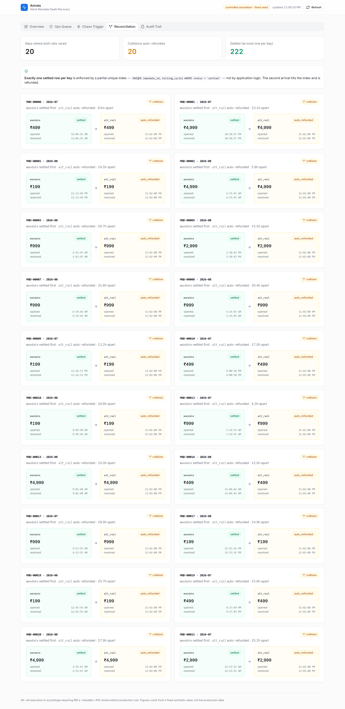
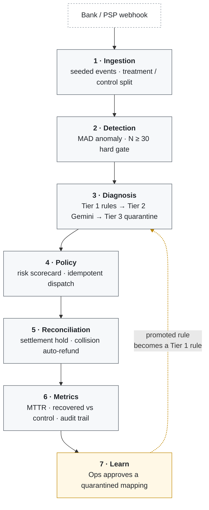

# Avirata — Silent Mandate Death Recovery Agent

**Catch UPI AutoPay mandates before they die, not after.**

| Overview | Chaos trigger | Reconciliation |
| :---: | :---: | :---: |
|  |  |  |

---

## The problem

A UPI AutoPay mandate rarely fails loudly. It fails once for a recoverable reason — the bank
was down for ten minutes, the payer's balance was short at 3am, an authentication window
timed out — and nobody notices, because a single decline looks like noise. By the time the
pattern is obvious the mandate is revoked, the customer has churned, and the revenue is gone
without a single support ticket being raised.

The industry default is to retry failed payments after the fact. That misses the window that
matters: the gap between *the first decline that had a fixable cause* and *the mandate going
permanently dead*. Recovery inside that gap is cheap and usually invisible to the customer.
Recovery after it is a win-back campaign.

## The approach

Every decision that moves money is deterministic and re-derivable by hand — a weighted
scorecard with published weights, not a model. The LLM is confined to one job: mapping an
ambiguous free-text decline string into a fixed ontology of seven causes. It classifies; it
never dispatches, never authorises, and never decides an amount. Anything it cannot map with
confidence is quarantined for a human rather than guessed at.

Everything is measured against a randomised control arm on the same seeded dataset, so the
headline recovery figure is a difference against a counterfactual rather than a restatement
of gross collections.

```
Detect → Diagnose → Policy → Reconcile → Measure → Learn
```

## What actually works

Every number below is produced by code in this repo and reproducible from a fixed seed.

**126 tests pass.** The database-backed tests run against real PostgreSQL 16 — the
idempotency and reconciliation guarantees are constraint behaviour, so testing them against
SQLite or a mocked lock would prove nothing. If Postgres is unreachable those 25 tests *skip
loudly* rather than passing vacuously. The Tier 2 LLM call is mocked in every test by design;
CI never touches the network.

**Diagnosis: 240/240 correct outcomes on the seeded corpus.** 232 events carried a
resolvable cause and all 232 were classified correctly, with zero wrong causes. The other 8
were deliberately novel strings, and all 8 correctly fell to Tier 3 quarantine rather than
being guessed at. Against **live Gemini**, `scripts/tier2_calibration.py` scores the 9
distinct ambiguous strings: 6/6 mappable ones correct, 3/3 novel ones quarantined.

**₹67,077 recovered against control** on the seeded 240-event run — ₹170,615 treatment
versus ₹103,538 control, across arms of 59 mandates each, for a **₹1,136.90 per-mandate
delta**. The control arm is not modelled as zero recovery: transient failures self-heal
there without intervention, which is what makes the delta a lift rather than a restatement.

**50.6% of dispatched actions resolved within the 24h SLA** (40 of 79; 17 still in flight).
The denominator is every dispatched action, not just resolved ones, so a growing backlog
cannot flatter the number.

**Idempotency holds under real concurrency.** A 100-thread burst and a 50-task
`asyncio.gather` burst, each hitting the same `(mandate_id, billing_cycle)` key against live
Postgres, produce **exactly one row and zero unhandled exceptions**. A start barrier releases
every worker simultaneously, because without one `ThreadPoolExecutor` staggers thread starts
and the test passes while never actually colliding. A permanent negative-control test runs a
naive `SELECT`-then-`INSERT` guard through the same harness and asserts that it *breaks* —
it does, with dozens of unique-violation errors per run — which is what proves the burst has
teeth.

**Double-charge prevention is enforced by the database.** At most one `settled` row per key
comes from a partial unique index, not application logic. Verified by dropping the index and
re-running the two-thread settlement race: it produced **two** settled rows, and recreating
the unique index then failed on the duplicate key. Postgres itself caught what the
application would have missed.

**The ontology loop closes, verified live end to end:** a novel decline code quarantines at
Tier 3 → an operator approves a mapping in the Ops Queue → the identical string on the next
event resolves at **Tier 1 with confidence 1.0 and no LLM call at all**.

## Architecture



## Guardrails that made the cut

- **No ML on money movement.** The LLM classifies into a fixed ontology and nothing else. The
  risk scorecard is four weighted signals summing to 1.0, each returned alongside the total so
  any decision can be re-derived by hand in an audit.
- **Sanitize in, schema-validate out.** Decline strings arrive from an untrusted webhook, so
  HTML tags, control characters and SQL metacharacters are stripped and the string is capped
  before prompt assembly. The reply is parsed against a strict `extra="forbid"` schema. A
  parse failure, a schema violation, an off-ontology cause or low confidence all route to
  quarantine — never a crash, never a silent default.
- **Idempotency is a database constraint, not an application lock.** `UNIQUE (mandate_id,
  billing_cycle)` plus `INSERT ... ON CONFLICT DO NOTHING RETURNING`. There is no
  read-then-write window to lose.
- **Every case terminates in a defined state.** A TTL watchdog sweeps anything stuck in
  `processing` past its window into `manual_escalation` and onto the Ops queue. Nothing sits
  invisible forever.
- **The cost-benefit gate is genuinely reachable.** It initially was not — under the shipped
  weights the risk gate always tripped first, making the second gate dead code. It was retuned
  (`risk_weight_amount` 0.4→0.5, `ALT_RAIL_COST_RUPEES` 12→1600) until it independently blocks
  real events, and `test_cost_benefit_gate_is_reachable` fails if a future retune kills it
  again.
- **Sparse data never produces a false anomaly.** MAD detection checks `N ≥ 30` before any
  arithmetic and returns an explicit `insufficient_data` status.

## Honest scope

**Real.** MAD anomaly detection; the 3-tier diagnosis cascade including live Gemini calls;
the deterministic policy engine; Postgres-enforced idempotency and reconciliation; the TTL
watchdog and comms mutex; the ontology promotion loop; the metrics layer and React dashboard.
All of it runs end to end against real PostgreSQL.

**Simulated, and labelled as such in code and UI.** Alt-rail payment-link delivery and refunds
are logged mock payloads, not real PSP calls. Outbound WhatsApp/SMS is recorded to the
database, not delivered. The ₹ recovered figure comes from a fixed synthetic seed and is
labelled *"controlled simulation, fixed seed"* on the dashboard itself. The control arm's
self-healing baseline is a stated modelling assumption, and `ALT_RAIL_COST_RUPEES = 1600` is a
fully-loaded cost assumption requiring finance sign-off, not a gateway fee.

**Not built.** Multi-tenant auth, production observability, and real RBI e-mandate / AFA
integration. Alt-rail execution is flagged in code as a **prototype requiring RBI e-mandate /
AFA review before any production use**. Ontology promotions are in-memory and revert on
restart. Cron loops are demo-scale pollers; production would be event-driven.

## Running it locally

```bash
git clone <repo-url> && cd Avirat

docker compose up -d db                              # PostgreSQL 16

python -m venv .venv
.venv\Scripts\pip install -r requirements.txt        # Windows; use .venv/bin/pip elsewhere

copy .env.example .env                               # then fill GOOGLE_API_KEY
```

Get a Gemini API key at **https://aistudio.google.com/apikey**.

```bash
.venv\Scripts\python scripts\seed_demo.py --live     # 240 events through the real pipeline
.venv\Scripts\python -m uvicorn app:app              # http://127.0.0.1:8000
```

Omit `--live` to seed with a deterministic offline Tier 2 stub — no API key, no cost, same
numbers. The frontend lives in `frontend/` and builds into `static/dist`, which FastAPI serves:

```bash
cd frontend
npm install && npm run build      # or: npm run dev  (Vite on :5173, proxies /api to :8000)
```

Tests:

```bash
.venv\Scripts\pytest
```

Note that the test suite truncates every table, so **re-run `seed_demo.py` after `pytest`**
or the dashboard will be empty.

Useful scripts: `scripts/tier2_calibration.py` scores live Gemini against the hidden
ground-truth labels; `scripts/gate_analysis.py` shows which alt-rail gate decides on each
eligible event.

## Tech stack

Python 3.12, FastAPI, SQLAlchemy 2, PostgreSQL 16, Google Gemini 3.5 Flash-Lite, React 18 +
Vite + TypeScript, Tailwind CSS, shadcn/ui, recharts, pytest.

---

Built for the Razorpay AI Buildathon 2026, AI Revenue Recovery track.
